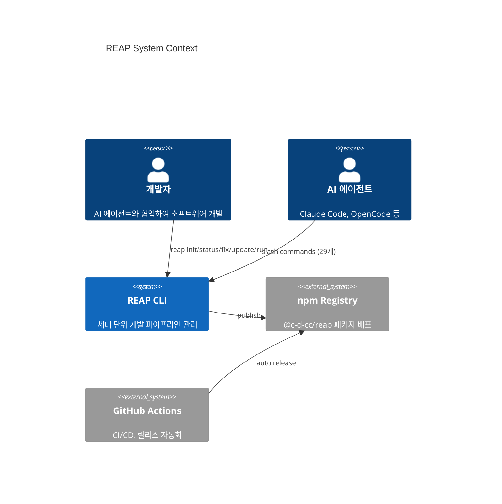
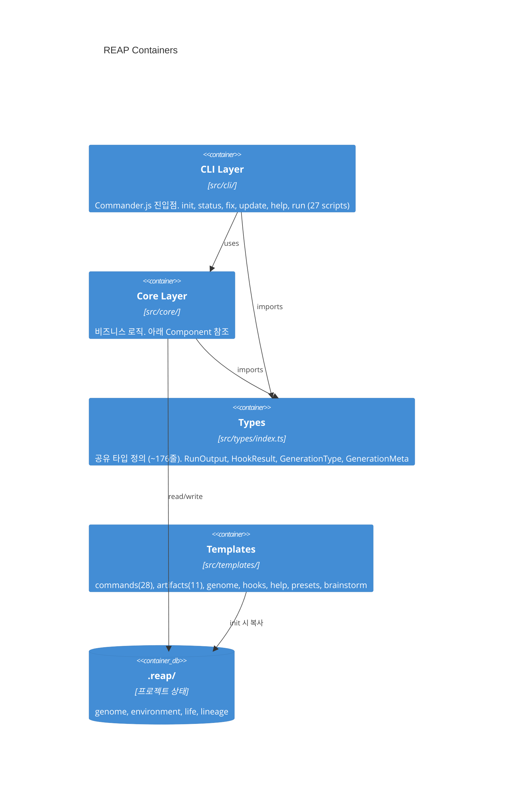

# Source Map

> C4 Container + Component 수준의 프로젝트 구조 맵.
> 에이전트가 코드 탐색 전 참조하여 진입점을 빠르게 파악하는 용도.
> 줄 수 한도: ~150줄 (코드베이스 ~2,000줄 기준. 규모 증가 시 비례 조정).
> Completion 단계에서만 수정된다.

## C4 Context



## C4 Container



## Core Components

```mermaid
C4Component
  title Core Layer Components

  Component(lifecycle, "LifeCycle", "lifecycle.ts", "Normal 5-stage 상태 머신. next/prev/canTransition")
  Component(mergeLifecycle, "MergeLifeCycle", "merge-lifecycle.ts", "Merge 5-stage 상태 머신. detect→completion")
  Component(generation, "GenerationManager", "generation.ts", "Normal generation. create/advance/complete")
  Component(mergeGeneration, "MergeGenerationManager", "merge-generation.ts", "Merge generation. create/advance/complete + findCommonAncestor")
  Component(lineage, "Lineage Utils", "lineage.ts", "공유 lineage 조회. listMeta/readMeta/nextSeq/resolveParents")
  Component(merge, "Merge Logic", "merge.ts", "genome diff, conflict 분류, sync test")
  Component(config, "ConfigManager", "config.ts", "YAML config read/write")
  Component(paths, "ReapPaths", "paths.ts", "경로 해석. project/user/package 레벨")
  Component(hooks, "Hooks", "hooks.ts", "SessionStart hook 등록/동기화/마이그레이션")
  Component(agents, "AgentRegistry", "agents/", "어댑터 추상화. Claude Code + OpenCode")
  Component(compression, "Compression", "compression.ts", "Lineage 자동 압축. L1(dir→md+frontmatter), L2(5×L1→epoch). DAG leaf 보호")
  Component(adaptation, "AdaptationManager", "adaptation.ts", "Generation adaptation 기록")
  Component(migration, "MigrationRunner", "migrations/", "버전 기반 migration registry. semver 범위 필터 + 순차 실행. legacy lineage DAG 변환 포함")
  Component(genomeSync, "GenomeSync", "genome-sync.ts", "프로젝트 스캔→genome 자동 생성. adoption/migration init 시 호출")
  Component(backlog, "Backlog Utils", "backlog.ts", "scanBacklog, markBacklogConsumed — backlog CRUD")
  Component(runOutput, "RunOutput", "run-output.ts", "emitOutput, emitError — structured JSON output")
  Component(hookEngine, "HookEngine", "hook-engine.ts", "hook 스캔, condition 평가, sh 실행 / md 반환")
  Component(commit, "CommitUtils", "commit.ts", "submodule check, git commit — checkSubmodules, commitChanges")
  Component(git, "Git Utils", "git.ts", "gitShow, gitLsTree, gitRefExists, gitAllBranches, gitCurrentBranch")
  Component(fs, "FS Utils", "fs.ts", "readTextFile, writeTextFile, fileExists")

  Rel(generation, lifecycle, "stage transitions")
  Rel(generation, lineage, "lineage 조회 위임")
  Rel(generation, compression, "archiving 시 호출")
  Rel(generation, paths, "경로 조회")
  Rel(mergeGeneration, mergeLifecycle, "merge stage transitions")
  Rel(mergeGeneration, lineage, "lineage 조회")
  Rel(mergeGeneration, merge, "conflict detection")
  Rel(mergeGeneration, compression, "archiving 시 호출")
  Rel(mergeGeneration, git, "git ref 기반 읽기")
  Rel(merge, git, "genome diff via git show")
  Rel(hooks, agents, "에이전트별 hook 등록")
  Rel(agents, paths, "에이전트별 경로")
  Rel(config, paths, "config 경로")
```



## CLI Commands

| Command | Entry Point | Description |
|---------|-------------|-------------|
| `reap init` | `cli/commands/init.ts` | 프로젝트 초기화. .reap/ 생성, genome/commands/hooks 설치 |
| `reap status` | `cli/commands/status.ts` | 프로젝트 상태 출력 |
| `reap fix` | `cli/commands/fix.ts` | .reap/ 구조 진단/복구 |
| `reap update` | `cli/commands/update.ts` | commands/templates/hooks 동기화 |
| `reap help` | `cli/index.ts` | 언어별 help 텍스트 출력 (en/ko) |
| `reap run` | `cli/commands/run/index.ts` | command script dispatcher (27개: next, back, start, completion, abort, push, objective, planning, implementation, validation, evolve, evolve-recovery, sync, sync-genome, sync-environment, help, report, merge-start, merge-detect, merge-mate, merge-merge, merge-sync, merge-validation, merge-completion, merge-evolve, merge, pull) |

## Agent Adapters

| Adapter | File | Commands Dir | Hook Method |
|---------|------|-------------|-------------|
| Claude Code | `agents/claude-code.ts` | `~/.claude/commands/` | settings.json SessionStart |
| OpenCode | `agents/opencode.ts` | `~/.config/opencode/commands/` | plugins/ JS 파일 |

## Data Flow

```
User/Agent → slash command (.md) → reap run <cmd> → Script Orchestrator (.ts)
                                                         ↓
                                                   core/ functions
                                                         ↓
                                                   .reap/ files (YAML/MD)
                                                         ↓
                                                   JSON stdout → AI follows prompt
```

## Key Constants

| Constant | Value | Location |
|----------|-------|----------|
| LINEAGE_MAX_LINES | 5,000 | compression.ts |
| RECENT_PROTECTED_COUNT | 3 | compression.ts |
| L1_LIMIT (hook) | 500 | genome-loader.cjs |
| L2_LIMIT (hook) | 200 | genome-loader.cjs |
| Staleness threshold | 10 commits | genome-loader.cjs |
